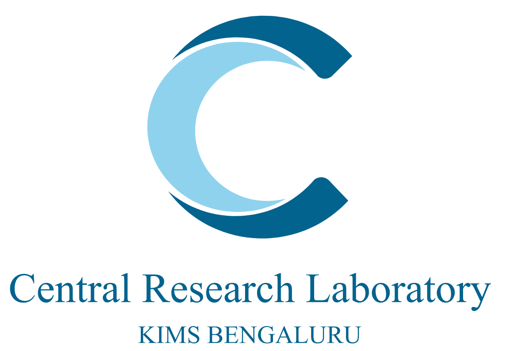

# Curso de bioinformática: Vigilancia genómica de *Streptococcus pneumoniae* y *Streptococcus agalactiae*
*Adaptado del curso: Advanced Bioinformatics Course developed for the GPS and JUNO projects.*

## Resumen

El proyecto GPS, es decir, el proyecto de secuenciación neumocócica global, es una red mundial de vigilancia genómica de *Streptococcus pneumoniae* que proporciona pruebas para el control de la enfermedad neumocócica. El proyecto JUNO es una vigilancia genómica global de *Streptococcus agalactiae*, que es una causa importante de enfermedad invasiva neonatal en todo el mundo. Uno de los objetivos principales de los proyectos GPS y JUNO es fortalecer la capacidad de nuestros colaboradores del proyecto en la generación y análisis de datos genómicos. 
Este curso está diseñado para capacitar a los participantes en la vigilancia genómica de *S. agalactiae* y *S. pneumoniae*. A través de este programa, los asistentes adquirirán conocimientos y habilidades esenciales para la generación, análisis e interpretación de datos genómicos relevantes para estos patógenos.
Este curso tiene como objetivo proporcionar a los participantes las herramientas necesarias para realizar una vigilancia genómica eficaz, contribuyendo así al control y prevención de enfermedades causadas por *S. agalactiae* y *S. pneumoniae*.

## Objetivos de aprendizaje

- Comprender los conceptos básicos de la secuenciación de nueva generación utilizando las plataformas Illumina y Nanopore.
- Prender a manejar la línea de comando de Linux.
- Identificar los formatos de los archivos NGS.
- Aplicar herramientas de línea de comandos realizar control de calidad de datos en lecturas generadas.
- Ensamblar lecturas, examinar el ensamblaje de salida y evaluar la calidad de las lecturas ensambladas.
- Anotar y visualizar el genoma anotado.
- Realizar serotipado, MLST y encontrar genes resisntentes a los antibiótios en genomas bacterianos provenientes de datos públicos latinoamericanos.
- Realizar la indexación del genoma de referencia, el mapeo de lecturas, la conversión de la salida a formato SAM/BAM, y el llamado de variantes utilizando bwa en datos de *S. pneumoniae*.
- Explicar y realizar análisis filogenéticos, incluyendo la lectura de árboles filogenéticos, la identificación de regiones de recombinación y la agrupación utilizando .
- Comprender y utilizar pipelines bioinformáticos para la vigilancia genómica de *S. pneumoniae* y *S. agalactiae*.

## Público objetivo

Este Curso Avanzado de Bioinformática está dirigido a estudiantes, investigadores o profesionales clínicos/sanitarios que forman parte de estas redes de vigilancia global o que tienen interés en aprender a llevar a cabo la secuenciación de nueva generación (NGS) y el análisis de genomas bacterianos (es decir, *Streptococcus pneumoniae* y/o *Streptococcus agalactiae*). Este curso se centrará en la aplicación de técnicas genómicas de vanguardia que actualmente se están implementando.

## Requisitos generales

Antes de comenzar este curso avanzado de bioinformática es recomendable haber revisado o completado los siguientes cursos:
"[Fundamental module 1 (F1)](https://training.bactgen.sanger.ac.uk/#/F1/)"
"[Fundamental module 2 (F2)](https://training.bactgen.sanger.ac.uk/#/F2/)"

## Programa

### Módulo 1: [Introducción a Google Colaboratory](https://github.com/cabana-online/Tutorial_Introduccion/blob/main/01.Intro_a_colab.ipynb)

Los módulos 1, 2 y 3 se encuentran en el repositorio de [Introducción](https://github.com/cabana-online/Tutorial_Introduccion)

Para comenzar, vaya a https://colab.research.google.com/.

En la página de inicio de Colab, seleccione "Archivo" y luego "Abrir bloc de notas". 

Hay una pestaña para "GitHub"; seleccione esa pestaña y pegue la siguiente URL en la barra de búsqueda debajo de "Ingresa una URL de GitHub o realiza una búsqueda por organización o usuario":

`https://github.com/cabana-online/Tutorial_Introduccion`

Después de una breve búsqueda verá el notebook:

`01.Intro_a_colab.ipynb`

Seleccione y verá el notebook abierto.

Para ejecutar las celdas, deberá iniciar sesión con su cuenta de Google (es libre de hacer una cuenta). El uso de Colab es gratis. 

**Nota:** existen limitaciones en la versión gratuita, pero no serán alcanzadas en este curso.

### Módulo 2: [Introducción a Notebooks y Unix/Linux.](https://github.com/cabana-online/Tutorial_Introduccion/blob/main/02.Modulo_2_linux.ipynb)

Vaya a https://colab.research.google.com/.

Seleccione el repositorio

`https://github.com/cabana-online/Tutorial_Introduccion`

Después de una breve búsqueda verá el notebook:

`02.Modulo_2_linux.ipynb`

Seleccione y verá el notebook abierto.

### Módulo 3: [Introducción a las tecnologías de NGS empleadas en el secuenciamiento del SARS-CoV-2.](https://github.com/cabana-online/Tutorial_Introduccion/blob/main/03.Modulo_3_NGS.ipynb)

Vaya a https://colab.research.google.com/.

Seleccione el repositorio

`https://github.com/cabana-online/Tutorial_Introduccion`

Después de una breve búsqueda verá el notebook:

`03.Modulo_3_NGS.ipynb`

Seleccione y verá el notebook abierto.

### Módulo 4: [Control de calidad de datos.](04.Modulo_4_QC.ipynb)

Vaya a https://colab.research.google.com/.

Seleccione el repositorio

`https://github.com/cabana-online/Vigilancia_genomica`

Después de una breve búsqueda verá el notebook:

`04.Modulo_4_QC.ipynb`

Seleccione y verá el notebook abierto.

### Módulo 5: [Clasificación taxónomica de las secuencias](05.Modulo_5_taxonomia.ipynb)

Vaya a https://colab.research.google.com/.

Seleccione el repositorio

`https://github.com/cabana-online/Vigilancia_genomica`

Después de una breve búsqueda verá el notebook:

`05.Modulo_5_taxonomia.ipynb`

Seleccione y verá el notebook abierto.

### Módulo 6: [Ensamblajes *De novo*.](06.Modulo_6_ensamblaje.ipynb)

Vaya a https://colab.research.google.com/.

Seleccione el repositorio

`https://github.com/cabana-online/Vigilancia_genomica`

Después de una breve búsqueda verá el notebook:

`06.Modulo_6_ensamblaje.ipynb`

Seleccione y verá el notebook abierto.

### Módulo 7:[Anotación de genomas](07.Modulo_7_anotacion.ipynb) 

Vaya a https://colab.research.google.com/.

Seleccione el repositorio

`https://github.com/cabana-online/Vigilancia_genomica`

Después de una breve búsqueda verá el notebook:

`07.Modulo_7_anotacion.ipynb`

Seleccione y verá el notebook abierto.

### Módulo 8:[Serotipado *Streptococcus pneumoniae* y *Streptococcus agalactiae* ](08.Modulo_8_serotipado.ipynb) 

Vaya a https://colab.research.google.com/.

Seleccione el repositorio

`https://github.com/cabana-online/Vigilancia_genomica`

Después de una breve búsqueda verá el notebook:

`08.Modulo_8_serotipado.ipynb`

Seleccione y verá el notebook abierto.

### Módulo 9:[MLST (Tipificación de secuencias multilocus)](09.Modulo_9_MLST.ipynb) 

Vaya a https://colab.research.google.com/.

Seleccione el repositorio

`https://github.com/cabana-online/Vigilancia_genomica`

Después de una breve búsqueda verá el notebook:

`09.Modulo_9_MLST.ipynb`

Seleccione y verá el notebook abierto.

### Módulo 10:[AMR](10.Modulo_10_AMR.ipynb) 

Vaya a https://colab.research.google.com/.

Seleccione el repositorio

`https://github.com/cabana-online/Vigilancia_genomica`

Después de una breve búsqueda verá el notebook:

`10.Modulo_10_AMR.ipynb`

Seleccione y verá el notebook abierto.

### Módulo 11:[Mapeo](11.Modulo_11_mapeo.ipynb) 

Vaya a https://colab.research.google.com/.

Seleccione el repositorio

`https://github.com/cabana-online/Vigilancia_genomica`

Después de una breve búsqueda verá el notebook:

`11.Modulo_11_mapeo.ipynb`

Seleccione y verá el notebook abierto.

### Módulo 12:[Llamado de Variantes](12.Modulo_12_llamado_de_variantes.ipynb) 

Vaya a https://colab.research.google.com/.

Seleccione el repositorio

`https://github.com/cabana-online/Vigilancia_genomica`

Después de una breve búsqueda verá el notebook:

`12.Modulo_12_llamado_de_variantes.ipynb`

Seleccione y verá el notebook abierto.

### Módulo 13:[Filogenética](13.Modulo_13_filogenetica.ipynb) 

Vaya a https://colab.research.google.com/.

Seleccione el repositorio

`https://github.com/cabana-online/Vigilancia_genomica`

Después de una breve búsqueda verá el notebook:

`13.Modulo_13_filogenetica.ipynb`

Seleccione y verá el notebook abierto.

### Módulo 14:[Flujos de trabajo (workflows/pipelines) bioinformático de NGS](14.Modulo_14_introduccion_pipelines.ipynb) 

Vaya a https://colab.research.google.com/.

Seleccione el repositorio

`https://github.com/cabana-online/Vigilancia_genomica`

Después de una breve búsqueda verá el notebook:

`14.Modulo_14_introduccion_pipelines.ipynb`

Seleccione y verá el notebook abierto.

### Módulo 15:[Flujos de Trabajo GPS y GBS](15.Modulo_15_GPS_unified_pipeline.ipynb) 

Vaya a https://colab.research.google.com/.

Seleccione el repositorio

`https://github.com/cabana-online/Vigilancia_genomica`

Después de una breve búsqueda verá el notebook:

`15.Modulo_15_GPS_unified_pipeline.ipynb`

Seleccione y verá el notebook abierto.

## Financiación

## Colaboradores

## Colaboradores

- Jolynne Mokaya- Wellcome Sanger Insitute
- Aasia Khaliq - Lahore University of Management Sciences
- Iqra Manzoor - Lahore University of Management Sciences
- Narender Kumar - Wellcome Sanger Institute
- Alejandro Castellanos - Universidad de los Andes
- Jebel Ceesay - MRC Unit The Gambia
- Nida Javaid - Lahore University of Management Sciences
- Alejandro Reyes - Universidad de los Andes
- Jolynne Mokaya - Wellcome Sanger Institute
- Njilan Johnson - MRC Unit The Gambia
- Alice Matimba - Wellcome Connecting Sciences
- Kate Mellor Wright - Wellcome Sanger Institute
- Peggy-Estelle Tientcheu - MRC Unit The Gambia
- Archibald Worwui - MRC Unit The Gambia
- Khalid Asif - Lahore University of Management Sciences
- Ravi Kumar - Central Research Laboratory KIMS
- Ana Ferreira - Wellcome Sanger Institute
- Luisa Sacristán - Universidad de los Andes
- Raymond Cheng - Wellcome Sanger Institute
- Bakary Sanyang - MRC Unit The Gambia
- Maria Alejandra Ulloa Mojica - Universidad de los Andes
- Shaper Mirza - Lahore University of Management Sciences
- Camilo García - Universidad de los Andes
- Martha Anita Demba - MRC Unit The Gambia
- Shreedhanya Marathe - Central Research Laboratory KIMS
- Clara Ìnes - Instituto Nacional de Salud, Colombia
- M Imran Nisar - The Aga Khan University
- Stephen Bentley - Wellcome Sanger Institute
- Dam Khan - MRC Unit The Gambia
- Martin Antonio - MRC Unit The Gambia
- Stephanie Lo - Wellcome Sanger Institute
- Dorota Jamrozy - Wellcome Sanger Institute
- Mathew Beale - Wellcome Sanger Institute
- Uzma Basit Khan - Wellcome Sanger Institute
- Elizabeth Castañeda - Instituto Nacional de Salud, Colombia
- Matthew Dorman - Wellcome Sanger Institute
- Varun Shamanna - Central Research Laboratory KIMS
- Felipe Sierra - Universidad de los Andes
- Mouhamadou Fadel Dipo - MRC Unit The Gambia
- Victoria Carr - Wellcome Sanger Institute
